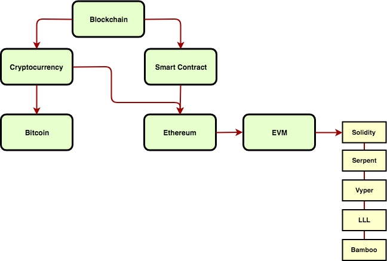

<h1>Blockchain & Cryptocurrency</h1>

A list of blockchain and cryptocurrency resources

 

## Table of Contents

- [Mindmap](#mindmap)
- [Jargon](#jargon)
- [Papers](#papers)
- [Books](#books)
- [Courses](#courses)
- [Documentaries](#documentaries)
- [News](#news)
- [Exchanges](#exchanges)
- [Explorers](#explorers)
- [Other](#other)

### Mindmap

### Jargon

[A](#a) ·
[B](#b) ·
[C](#c) ·
[D](#d) ·
[E](#e) ·
[F](#f) ·
[G](#g) ·
[H](#h) ·
[I](#i) ·
[J](#j) ·
[K](#k) ·
[L](#l) ·
[M](#m) ·
[N](#n) ·
[O](#o) ·
[P](#p) ·
[Q](#q) ·
[R](#r) ·
[S](#s) ·
[T](#t) ·
[U](#u) ·
[V](#v) ·
[W](#w) ·
[X](#x) ·
[Y](#y) ·
[Z](#z)

#### A

* __addess__ — encoded base58check version of a public key 160-bit hash
* __account__ — object containing an address, balance and nonce, and optional storage and code. An account can be a contract account or an EOA.
* __ABI__ — Application Binary Interface, used in Ethereum

#### B

* __babbage__ — ether’s denominations (`10^3` [wei](#w))
* __BCH__ — Bitcoin Cash
* __BIP__ — Bitcoin Improvement Proposals
* __blockchain__ — a distributed p2p database (public or private) containing a list of validated [blocks](#b)
* __BTC__ — Bitcoin
* __block__ — a group of transactions
* __Byzantine Generals Problem__ — 
* __bitcoin__ — symbol ฿ or ₿

#### C

* __coinbase__ — field used as the sole input for coinbase transactions
* __coinbase transaction__ — the first transaction in a block, contains the reward for the miner, here the new bitcoin is created and added in the supply
* __cold storage__ — keeping a reserve of bitcoin offline private keys are created and stored in a secure offline environment
* __colored coins__ — using on-blockchain digital assets to represent custom currencies and financial instrument
* __consensus__ — 

#### D

* __DAO__ — decentralized autonomous organizations
* __difficulty__ — how much computation is required to produce a proof of work
* __difficulty retargeting__ — network-wide recalculation of the difficulty, occurs once every 2.016 blocks
* __double spending__ — a problem that should be avoided, that is successfully spending some money more than once
* __DApps__ — decentralized applications that run on a P2P network of computers
* __DEX__ — decentralized cryptocurrency exchange
* __DeFi__ — Decentralized Finance

#### E

* __Ethereum__ — The Ethereum network
* __ether__ — the Ethereum currency (symbol Ξ)
* __ETH__ — the Ethereum currency
* __ERE__ — Ethereum Runtime Environment
* __EVM__ — Ethereum Virtual Machine
* __EVM Code__ — the bytecode that the [EVM](#e) can natively execute
* __EVM Assembly__ — the human-readable form of [EVM Code](#e)
* __EOA__ — Externally Owned Account
* __EIP__ — Ethereum Improvement Proposals
* __ECDSA__ — Elliptic Curve Digital Signature Algorithm
* __ERC__ — Ethereum Request for Comments
* __EEH__ — Ethereum currency unit

#### F

* __Frontier__ — is the first live release of the Ethereum network
* __finney__ — ether’s denominations (`10^15` [wei](#w))
* __fees__ — sender of a transaction often includes a fee to the network for processing the requested transaction
* __fungible token__ — 

#### G

* __gas__ — a virtual currency used in Ethereum to constrain computation of smart contracts, the fundamental network cost unit
* __genesis block__ — the first block in the blockchain
* __Geth__ — an implementation of Ethereum written in the Go programming language
* __grand__ — ether’s denominations (`10^21` [wei](#w))

#### H

* __Homestead__ — release of the Ethereum network (successor of [Frontier](#f))
* __hard fork__ — a permanent divergence in the blockchain
* __hardware wallet__ — special type of bitcoin wallet which stores the user’s private keys in a secure hardware device
* __hash__ — digital fingerprint of some binary input
* __HTLC__ — Hashed TimeLock Contract

#### I
#### J
#### K

* __Kovan__ — public Ethereum testnet

#### L

* __Lightning Networks__ — 
* __lovelace__ — ether’s denominations (`10^6` [wei](#w))

#### M

* __miner__ — network node that finds valid proof of work for new blocks
* __mempool__ — collection of all transaction data in a block that have been verified by bitcoin nodes but not yet confirmed
* __message__ — internal transaction that is never serialized and only sent within the EVM
* __Morden__ — public Ethereum testnet
* __merkle root__ — 
* __merkle tree__ — 
* __multisignature__ — 

#### N

* __non fungible token__ — 

#### O

* __orphans__ — blocks that do not have a known parent in the knows chain

#### P

* __Parity__ — an implementation of Ethereum written in the Rust programming language
* __Proof-of-Stake__ — asks users to prove ownership of a certain amount of cryptocurrency
* __Proof-of-Work__ — 
* __P2PKH__ — Pay-to-Public-Key-Hash
* __P2WPKH__ — Pay-to-Witness-Public-Key-Hash

#### Q
#### R

* __Ropsten__ — public Ethereum testnet
* __Rinkeby__ — public Ethereum testnet
* __RLP__ — Recursive Length Prefix, encoding scheme in Ethereum

#### S

* __Satoshi Nakamoto__ — name used by the person or people who designed Bitcoin and created its original reference implementation
* __satoshi__ — the smallest unit of the bitcoin cryptocurrency (1 `BTC` = 100,000,000 `satoshis`)
* __Serpent__ — programming language with syntax similar to Python
* __Solidity__ — programming language with syntax that is similar to Javascript, C++ or Java, most frequently used language for Ethereum smart contracts
* __SVP__ — Simplified Payment Verification
* __smart property__ — the ownership of an underlying physical device
* __smart contracts__ — complex applications involving having digital assets being directly controlled by a piece of code implementing arbitrary rules, more precisely a computer program that, given certain conditions, can enforce the execution of a set of instructions without third party interference
* __shannon__ — ether’s denominations (`10^9` [wei](#w))
* __szabo__ — ether’s denominations (`10^12` [wei](#w))
* __Segregated Witness__ — a proposed upgrade to the Bitcoin protocol which technological innovation separates signature data from bitcoin transactions
* __soft fork__ — 

#### T

* __Turing completeness__ — a program language is that can run any program that a Turing machine can run
* __token__ — 

#### U

* __UTXO__ — Unspent Transaction Output

#### V

* __Viper__ — high-level programming language, similar to Serpent and with Python-like syntax

#### W

* __wallet__ — software that holds all your secret keys
* __WIF__ — Wallet Import Format
* __wei__ — smallest unit possible in Ethereum (`1 quintillion` = `10^18` = `1,000,000,000,000,000,000`)

#### X
#### Y
#### Z

### Papers

* [Bitcoin: A Peer-to-Peer Electronic Cash System](https://bitcoin.org/bitcoin.pdf) — Satoshi Nakamoto
* [Ethereum: Yellow Paper](https://ethereum.github.io/yellowpaper/paper.pdf)
* [Time, Clocks, and the Ordering of Events in a Distributed System](https://www.microsoft.com/en-us/research/uploads/prod/2016/12/Time-Clocks-and-the-Ordering-of-Events-in-a-Distributed-System.pdf) — Leslie Lamport
* [The Byzantine Generals Problem](https://www.microsoft.com/en-us/research/uploads/prod/2016/12/The-Byzantine-Generals-Problem.pdf) — Leslie Lamport
* [Distributed Snapshots: Determining Global States of Distributed Systems](https://citemaster.net/get/dca2d7de-5ea6-11e6-95ba-00163e009cc7/10.1.1.119.7694.pdf) — Leslie Lamport, Mani Chandy
* [Paxos Made Simple](https://www.microsoft.com/en-us/research/uploads/prod/2016/12/paxos-simple-Copy.pdf) — Leslie Lamport
* [The Part-Time Parliament](https://www.microsoft.com/en-us/research/uploads/prod/2016/12/The-Part-Time-Parliament.pdf) — Leslie Lamport
* [Zerocash: Decentralized Anonymous Payments from Bitcoin](http://zerocash-project.org/media/pdf/zerocash-oakland2014.pdf)
* [Zerocash: Decentralized Anonymous Payments from Bitcoin (extended version)](http://zerocash-project.org/media/pdf/zerocash-extended-20140518.pdf)
* [The Libra Blockchain](https://developers.libra.org/docs/assets/papers/the-libra-blockchain.pdf)
* [A Fistful of Bitcoins: Characterizing Payments Among Men with No Names](https://cseweb.ucsd.edu/~smeiklejohn/files/imc13.pdf)
* [SoK: Research Perspectives and Challenges for Bitcoin and Cryptocurrencies](https://users.soe.ucsc.edu/~owen/courses/cmps223/papers/bitcoin.pdf)
* [An Empirical Analysis of Traceability in the Monero Blockchain](https://www.degruyter.com/downloadpdf/j/popets.2018.2018.issue-3/popets-2018-0025/popets-2018-0025.pdf)

### Books

* [Mastering Bitcoin](https://www.amazon.com/Mastering-Bitcoin-Programming-Open-Blockchain/dp/1491954388) — Andreas M. Antonopoulos (2nd edition, 2017, [git repo](https://github.com/bitcoinbook/bitcoinbook))
* [Mastering Ethereum](https://www.amazon.com/Mastering-Ethereum-Building-Smart-Contracts/dp/1491971940) — Andreas M. Antonopoulos,  Gavin Wood (1nd edition, 2018, [git repo](https://github.com/ethereumbook/ethereumbook))
* [Digital Gold](https://www.amazon.com/Digital-Gold-Bitcoin-Millionaires-Reinvent/dp/006236250X) — Nathaniel Popper (2016)
* [The Age of Cryptocurrency](https://www.amazon.com/Age-Cryptocurrency-Blockchain-Challenging-Economic/dp/1250081556) — Michael J. Casey, Paul Vigna (2016)
* [Blockchain Revolution](https://www.amazon.com/Blockchain-Revolution-Technology-Changing-Business/dp/1101980133) — Don Tapscott, Alex Tapscott (2016)
* [Cryptoassets](https://www.amazon.com/Cryptoassets-Innovative-Investors-Bitcoin-Beyond/dp/1260026671) — Chris Burniske, Jack Tatar (2017)

### Courses

* [Bitcoin](https://www.khanacademy.org/economics-finance-domain/core-finance/money-and-banking/bitcoin/v/bitcoin-what-is-it) — Khan Academy
* [Bitcoin and Cryptocurrency Technologies](https://www.coursera.org/learn/cryptocurrency) — Arvind Narayanan, Princeton University
* [CS 251: Bitcoin and Cryptocurrencies](https://crypto.stanford.edu/cs251/) — Standford University

### Documentaries

* [Banking on Bitcoin](https://www.netflix.com/title/80154500)

### News

* [bitcointalk.org](https://bitcointalk.org/)
* [Coindesk](https://www.coindesk.com)
* [Bloomberg Crypto](https://www.bloomberg.com/crypto)
* [bitcoinmagazine.com](https://bitcoinmagazine.com/)
* [theblockcrypto.com](https://www.theblockcrypto.com)

### Exchanges

* [poloniex.com](http://poloniex.com)
* [coinbase.com](http://coinbase.com)
* [bitfinex.com](http://bitfinex.com)
* [bitstamp.net](http://bitstamp.net)
* [bittrex.com](http://bittrex.com)
* [gdax.com](http://gdax.com)
* [gemini.com](http://gemini.com)
* [kraken.com](http://kraken.com)
* [bithumb.com](http://bithumb.com)

### Explorers

* [blockchain.com](http://blockchain.com)
* [btc.com](https://btc.com)
* [etherscan.io](http://etherscan.io)

### Other

* [CoinGecko](https://www.coingecko.com)
* [coinmarketcap.com](https://coinmarketcap.com/)
* [Bitcoin](https://bitcoin.org)
* [Ethereum](https://www.ethereum.org/)
* [P2SH](https://p2sh.info)
* [Bitcoin Resources](http://lopp.net/bitcoin.html)
* [Bitnodes: Global Bitcoin Nodes Distribution](https://bitnodes.earn.com/)
* [bitcoin.com](http://bitcoin.com)
* [bitcoin.org](http://bitcoin.org)
* [bitgo.com](http://bitgo.com)
* [bitpay.com](http://bitpay.com)
* [circle.com](http://circle.com)
* [copay.io](http://copay.io)
* [ledgerwallet.com](http://ledgerwallet.com)
* [myetherwallet.com](http://myetherwallet.com)
* [trezor.io](http://trezor.io)
* [xapo.com](http://xapo.com)
* [ethgasstation.info](https://ethgasstation.info)
* [ethstats.net](https://ethstats.net/)
* [blockseer.com](https://www.blockseer.com/)
* [blockchair.com](https://blockchair.com/)
* [cryptocompare.com](https://www.cryptocompare.com/)
* [cryptowat.ch](https://cryptowat.ch/)
* [cryptozombies.io](https://cryptozombies.io/)
* [bitinfocharts.com](https://bitinfocharts.com/)
* [bravenewcoin.com](https://bravenewcoin.com/)
* [bitinfocharts.com](https://bitinfocharts.com/)
* [coincap.io](http://coincap.io)
* [exchangewar.info](https://exchangewar.info)
* [dappinsight.com](https://dappinsight.com/)
* [crypto51.app](https://www.crypto51.app/)
* [stateofthedapps.com](https://www.stateofthedapps.com/)